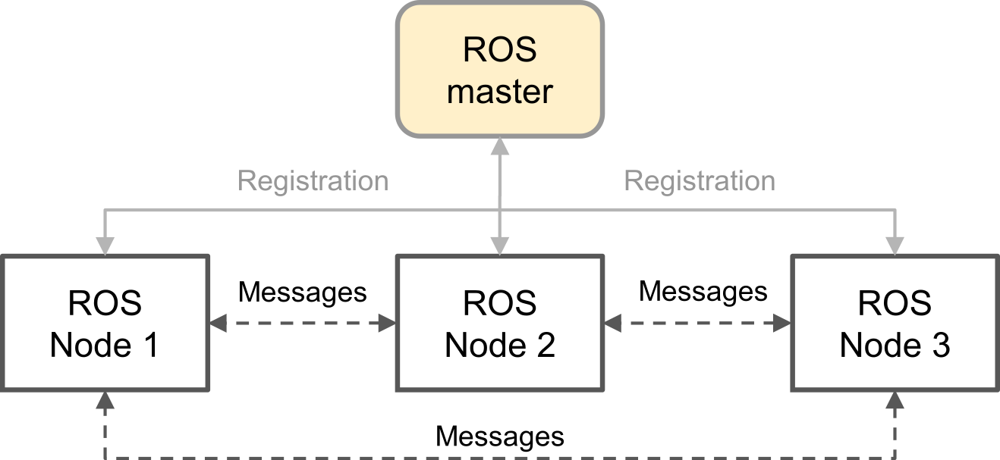
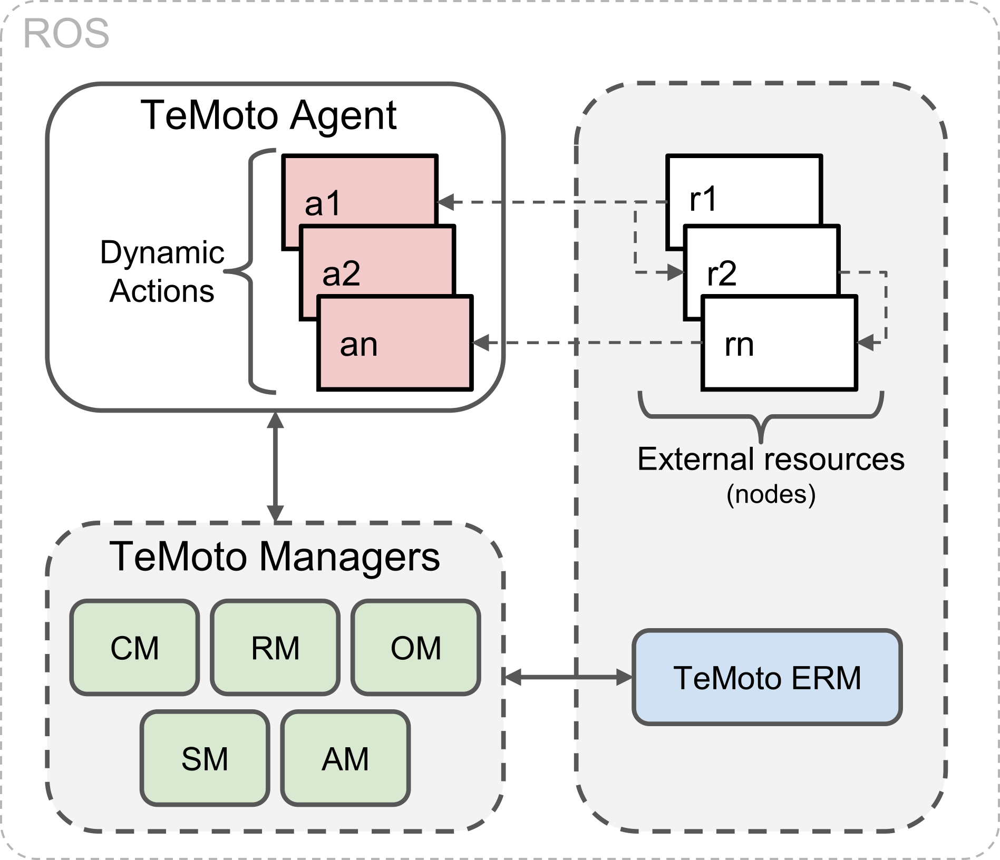
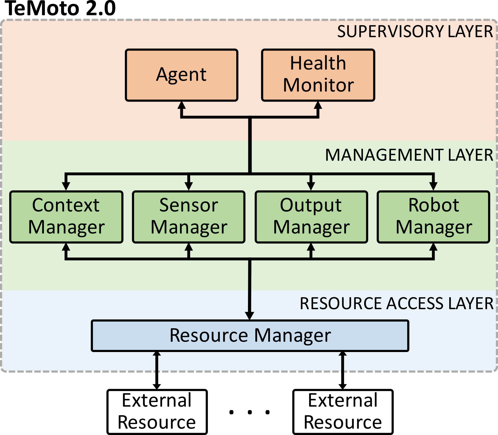

<div align="justify">

* [About TeMoto](#about-temoto)
  * [What is it?](#what-is-it)
  * [Why would I need it?](#why-would-i-need-it)
  * [TeMoto applicatons vs traditional ROS applications](#temoto-applicatons-vs-traditional-ros-applications)
  * [Conceptual overview of TeMoto](#conceptual-overview-of-temoto)
* [TeMoto 2 install guide](#temoto-2-install-guide)
  * [Ubuntu 16.04](#ubuntu-1604)

# About TeMoto

## What is it? ##
TeMoto is a telerobotics application development framework that is built upon ROS. TeMoto helps to integrate and manage different user-defined sequences of code (*actions*) and hardware *resources* like actuators, robots and sensors. 

## Why would I need it? ##
A teleoperation process may comprise many different subtasks. Ultimatlely the application developer solves the tasks by introducing one or a bunch of computer programs. The architecture of the composed software depends on the requirements of the problem at hand, ranging from simple to sophisticated in terms of:
* **Reusability** - Should/Can the developed software be reused for other applications?
* **Extendability** - How easy it is to add new features to the software?
* **Scalability** - Can the software be extended to multiple robots that work towards the same goal?
* **Redundancy** - How easy it is to interchange similar components in the system?

TeMoto is a framework that helps to create and manage applications that tend to be sophisticated in the above mentioned terms. So if you are developing a telerobotics application and the code starts to look like a bowl of sphagetti, then you may consider using TeMoto.

## TeMoto applicatons vs traditional ROS applications ##

Applications developed in ROS are traditionally managed solely by the user. An application in ROS can be a simple executable/node or a complex combination of different nodes that work together (Fig. 1). Typically the latter is the case and in order to start the application, the user would need to either run each node manually (rosrun) or use launch files (roslaunch). After doing so, the node graph (configuration of running nodes) essentially remains static.

<p align="center" >
  
  <br></br> 
  <b> Fig. 1: </b> Conceptual layout of a "traditional" ROS application 
</p>

TeMoto's framework introduces a way to organize user-code into chunks called *actions* (see Fig. 2). An *action* can run arbitrary user-written code and can also request/control *resources* (including nodes) via *managers* (Explained further in the [conceptual overview](#Conceptual-overview-of-TeMoto) section). The *actions* are invoked dynamically via natural language and hence the *resources* are started or stopped dynamically during run-time. Essentially TeMoto allows the user to programatically manage nodes during run-time. That's just one feature of the TeMoto's framework but in principle, this is how "traditional" and TeMoto applications differ.

<p align="center" >
  
  <br></br>
  <b> Fig. 2: </b> Conceptual layout of an application in TeMoto. 
</p>

## Conceptual overview of TeMoto ##

The architecture of TeMoto centers around the concept of a *resource* which is regarded as something that is *provided upon a request*. For example, sensors and algorithms are resources for acquiring and manipulating data respectively. Output systems such as speakers or manipulators are resources for interacting with the environment and information about physical objects in the surrounding environmentis viewed as a resource.

The architecture of TeMoto (Fig. 3) is structured into three hierarchical abstract layers and subsystems within:
* **Supervisory layer** is the top level layer that handles the interaction with the human operator and directs the rest of the system.
* **Management layer** is responsible for acquiring and managing resources via respective manager subsystems.
* **Resource Access layer** allows the management layer to access resources that are external to TeMoto, e.g., sensors, actuators.

<p align="center" >
  
  <br></br>
  <b> Fig. 3: </b> Architecture of TeMoto. 
</p>

The layers are ordered in decreasing level of abstraction. Let’s consider an example where the Supervisory layer requests a continuous stream of information about the pose of operator’s arm. Since the Supervisory layer is on the highest level of abstraction, information about how the pose has to be be acquired is required. The request is directed to the Management layer, more specifically, to the Context Manager that, among other things, maintains knowledge related to the operator. The Context Manager chooses the most suitable hand tracking method depending on the nature of the request. Suppose the hand pose could be detected either by a dedicated hand tracker device or via combination of a camera and a hand tracking algorithm. Assuming the first option was considered the best, Context Manager requests the Sensor Manager to start a hand tracker. The Sensor Manager finds a hand tracker that fits the criteria and sends the details about the specific device to Resource Access layer. Next, the Resource Manager initiates the specific device via information provided by the Sensor Manager. After successful initialization, the information about how to receive the data from the device is passed back to the upper layers.
The layered architecture reduces the system specific knowledge required from the operator and naturally favours the redundant design. A failed sensor in the bottom layer can be replaced by other suitable candidate without interrupting the workflow in the layer above. The following subsections describe each layer in detail.

# TeMoto 2 install guide

## Ubuntu 16.04
**1. Clone TeMoto to your catkin_workspace/src directory**
```
cd <your_catkin_ws>/src
git clone https://github.com/UTNuclearRobotics/temoto2.git
```

**2. Install TeMoto dependancies via installer script**
```
bash ./temoto2/temoto_2/scripts/install_temoto_deps.sh
```

**3. Install MeTA natural language processor via installer script**

This script will 
* install MeTA related dependancies (asks your password)
* clone, build and test MeTA
* download the language model files

PS: The whole process may take up to few minutes.
```
bash ./temoto2/temoto_2/scripts/install_meta.sh
```

**4. Build your catkin workspace**
```
cd <your_catkin_ws>
catkin_make
```

</div>
